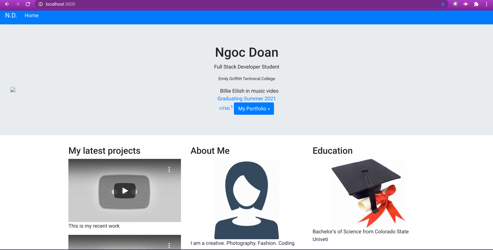

# Final-DB

## **Developer**: Ngoc Doan
## **Place:** *Denver, CO*
## **Institute: Emily Griffith Technical College
## **Title**: Node/Express Final Project 

## **Date: March 22, 2021
## **Goal**:
Final Database Project including Use Node, Express, A new framework, or language (jade, handlebars etc) Create a *fullstack project minus the database. 

Clone this repo here: https://github.com/ndoan24/Final-DB

Format: 

## **Code**: Node, Express, Bootstrap, HTML, Node Modules, npm i, npm i express, npm i jade, npm nodemailer 
